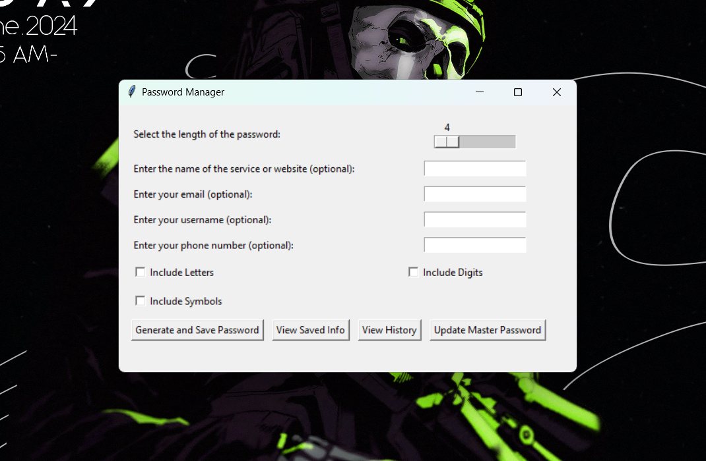
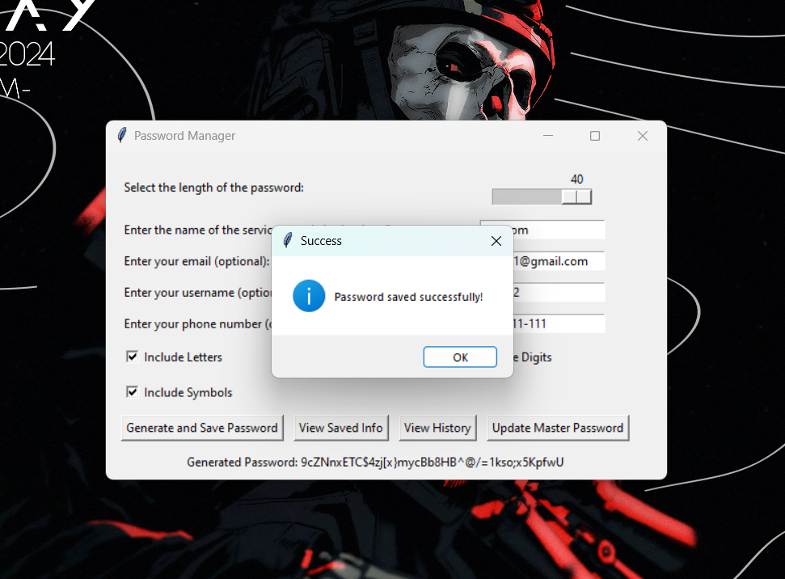
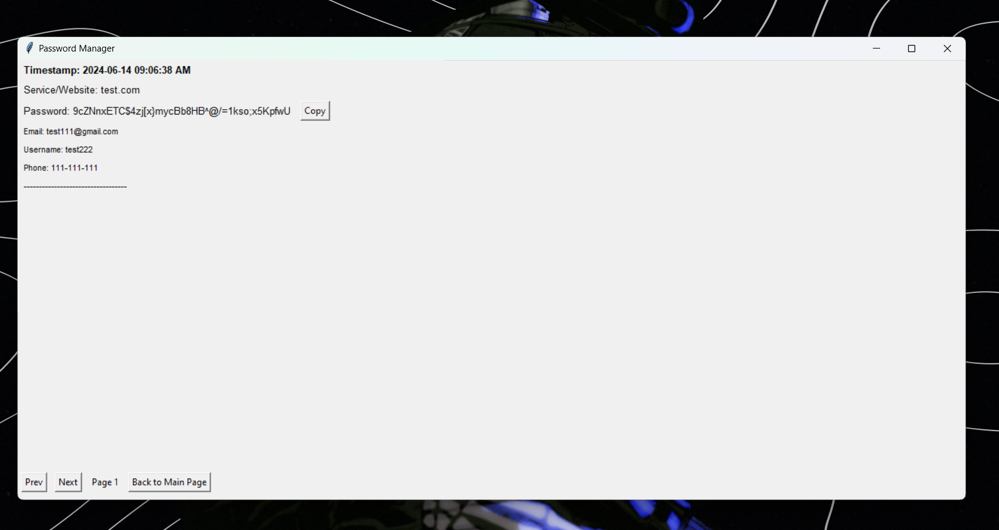
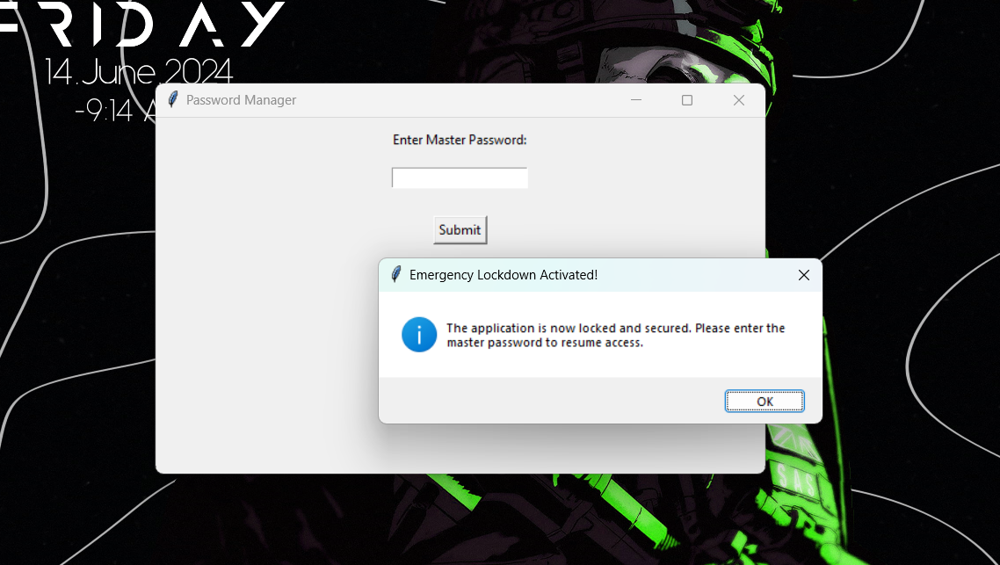
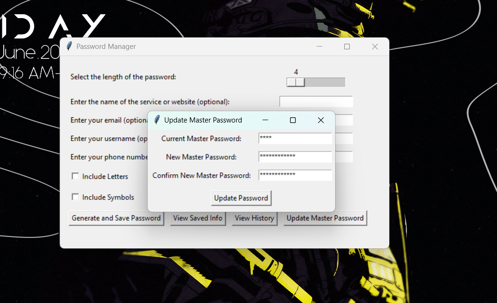
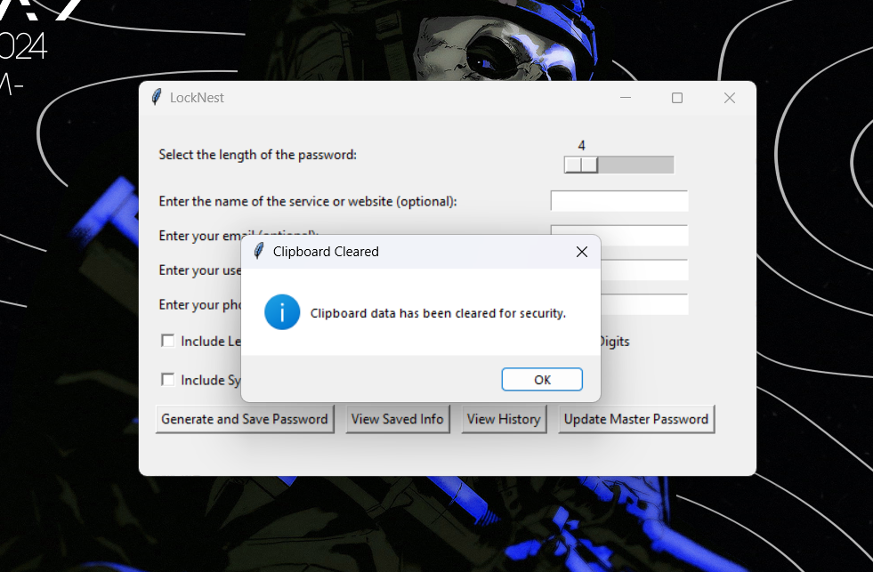

## 🔐 LockNest

LockNest is a password manager designed to provide convenience and security.


> [!NOTE]
> Released this program a bit late but for good reasons, ensuring user data is protected and safety measures are in place. Also, if you do plan on using this program, it is highly recommended to use a strong, hard password to protect your data securely. I did also include a more thorough explanation of the security down below.

> [!WARNING]
> Starting June 6, 2024, Dashlane's Free plan will have a 25-password storage limit, and accounts exceeding this limit will become read-only. This means passwords will no longer autofill, and no new passwords can be added without upgrading the plan or reducing the number of saved passwords.

## Features

- 🔑 **Password Generation**: Generate secure passwords with customizable length and character types (letters, digits, symbols).
- 💾 **Save and Manage Passwords**: Save passwords along with service name, email, username, and phone number.
- 🔒 **Encryption**: Passwords are encrypted using the master password and stored securely in an SQLite database.
- ✂️ **Clipboard Management**: Automatically clear clipboard data after a specified period.
- ⏰ **Inactivity Lock**: Automatically lock the application after a period of inactivity.
- 🚨 **Emergency Lockdown**: Immediately lock the application with a button click or key combination (Ctrl+L).
- 📜 **Password History**: Track changes to passwords and other information, with a viewable history of all modifications.

## 🔨Installation

1. Clone the repository:
   ```bash
   git clone https://github.com/GR1MR34P3R-1/LockNest.git
   ```
   ```bash
   cd password-manager
   ```

2. Install the required dependencies:
    ```bash
    pip install -r requirements.txt
    ```

## 🚀 Usage

1. **Run the application:**

    ```bash
    python main.py
    ```

2. **Enter your master password** to unlock the application. If it's the first time running, you'll be prompted to set a master password.

3. Use the **main menu** to generate and save passwords, view saved information, and update the master password.

4. Use the **Emergency Lockdown** press `Ctrl+L` to immediately lock the application.

## ⚙️ Configuration

- **Clipboard Clear Delay**: Set the duration (in minutes) after which the clipboard data will be cleared.

    ```python
    CLIPBOARD_CLEAR_DELAY_MINUTES = 0.5  # 30 seconds adjust as needed
    ```

- **Inactivity Lock Delay**: Set the duration (in minutes) after which the application will lock due to inactivity.

    ```python
    INACTIVITY_LOCK_DELAY_MINUTES = 0.5  # 30 seconds adjust as needed
    ```

## 🔒 **Security Measures**

### 🔑 **Master Password**

Upon first use, users are prompted to set a **master password**. This password is crucial as it is used to **encrypt** and **decrypt** all stored data, ensuring that only those with the master password can access the information.

### 🔐 **Encryption**

All passwords and sensitive information are **encrypted using the master password**. The encryption is performed using a strong encryption algorithm (`Fernet symmetric encryption`), ensuring that even if the database file is accessed by unauthorized parties, the data remains protected and unreadable without the master password.

### 🗄️ **Secure Storage**

The application uses an **SQLite database** to store passwords and other information. Each piece of information (password, email, username, phone number) is individually **encrypted** before being saved to the database. This approach ensures that all sensitive data remains secure.

### ✂️ **Clipboard Management**

The application **automatically clears clipboard data** after a specified period. This prevents sensitive information from being inadvertently exposed through the clipboard.

### ⏰ **Inactivity Lock**

The application features an **inactivity lock** that automatically locks the application after a period of inactivity. This measure ensures that the application is not left open and accessible when not in use, reducing the risk of unauthorized access.

### 🚨 **Emergency Lockdown**

For added security, users can immediately lock the application using the **Emergency Lockdown** feature. This can be triggered through a key combination (`Ctrl+L`), providing a quick way to secure the application in urgent situations.


## Screenshots

Below are screenshots showcasing various features of LockNest. All images are stored in the `IGNORE` folder in the same directory as the main program.

1. **Main Interface**  
   

2. **Password Generation**  
   

3. **Password History**  
   

5. **Emergency Lockdown**  
   

6. **Master Password Update**  
   

8. **Clipboard Management**  
   


## Contributing 🤝

Contributions to the project are welcome! Feel free to fork the repository and submit pull requests.

[](https://github.com/GR1MR34P3R-1/LockNest/fork) [](https://github.com/GR1MR34P3R-1/LockNest/pulls)

## Issues 🚨

If you encounter any issues or have suggestions for improvements, please report them!

[](https://github.com/GR1MR34P3R-1/LockNest/issues)


## License 📄
This project is licensed under the [MIT License](LICENSE). See the LICENSE file for details.
